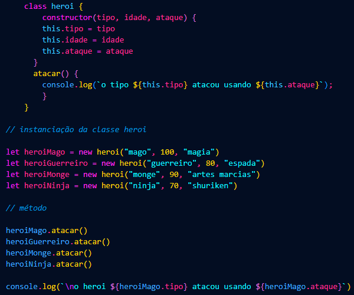

# 3️⃣ Escrevendo as classes de um Jogo

## Desafio com a proposta de criar uma classe em JavaScript que represente um herói de aventura com propriedades, como *nome*, *idade* e *tipo*, podendo ser *mago*, *guerreiro*, *monge* ou *ninja*, com o tipo de ataque seguindo a tabela abaixo

Tipo | Ataque
-----|---------
Mago | Magia
Guerreiro | Espada
Monge | Artes Marciais
Ninja | Shuriken
   

### Classe
Primeiro, a classe *heroi* é definida com três propriedades: *tipo*, *idade* e *ataque*. No método *atacar*, a mensagem *"o tipo {this.tipo} atacou usando {this.ataque}"* é exibida, indicando o tipo e o método de ataque do herói.

### Instanciação (Objetos a partir da classe *heroi*)
*heroiMago*, com tipo *mago*, idade *100* e ataque *magia*;  
*heroiGuerreiro*, com tipo *guerreiro*, idade *80* e ataque *espada*;  
*heroiMonge*, com tipo *monge*, idade *90* e ataque *artes marciais*;  
*heroiNinja*, com *tipo* *ninja*, idade *70* e ataque *shuriken*.

Cada um desses heróis chamará o método *atacar()*, exibindo suas respectivas mensagens de ataque.

### Saída
Por fim, uma linha adicional exibe a mensagem personalizada *"o heroi mago atacou usando Magia"*. Ou seja, mostra o tipo do herói *heroiMago (mago)* e o ataque do herói *heroiMago (magia)*

Assim, todo o código ilustra como criar heróis com diferentes características e tipos de ataque, além de demonstrar a flexibilidade de acessar e exibir propriedades específicas dos objetos 💥🛡️

> O código é uma demonstração de como criar e manipular objetos em JavaScript.